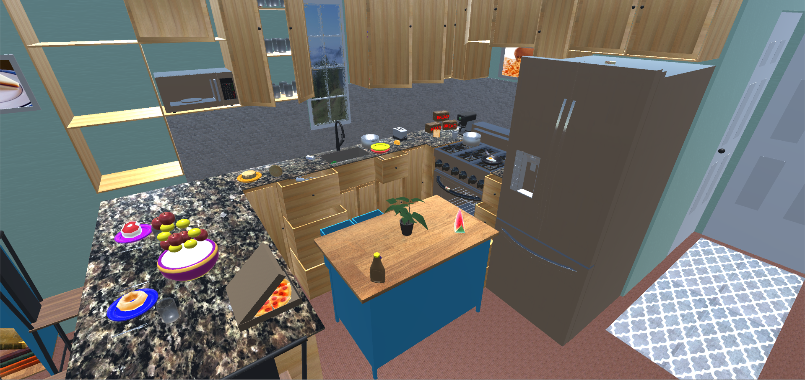
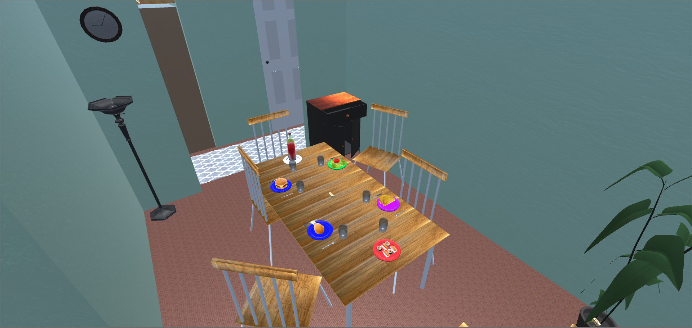
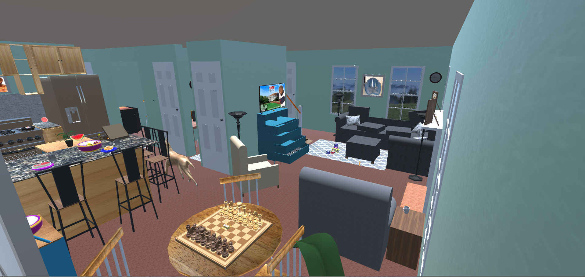

# Waffle Simulator
**By Tyler Ouellette** 
Endicott Class of 2020 
Computer Science Thesis 

**Description**: Have you ever wanted to experience what it's like to be a sentient WAFFLE?! Well, this is the game for you! In this Unity-based video game, play as a waffle, explore a house, meet some fun characters, completed quests, and find hidden secrets scattered throughout the map. Experience all this and more in WAFFLE SIMULATOR! 

**Screenshots**:    

**Launching the Game**: Go to [this link]( https://drive.google.com/file/d/1Wcda994nEiJKNDzfpcs1_5eAI3PIETNl/view?usp=sharing), download the .zip, put it in its own folder, right click on it, select extract here, launch "Waffle-Simulator.exe," and enjoy! 

**Endicott College Thesis**: Part of the curriculum at Endicott College requires that students complete a thesis during their senior year. For Computer Science majors, this involves making or refining something related to computer science, whether it be software, hardware, or anything else. I decided to make a video game for my thesis since I have always been interested in game design and creation. 
 
**Scripts and what they do**: Many of the classes in the repo are for very small portions of the game and only control one or two things. The most important classes are as follows:
* AchievementsController.cs - Keeps track of all of the achievements that the player has unlocked, updates UIs with achievement "banners," and checks if conditions have been met to unlock achievements. 
* DialogueTrigger.cs and DialogueManager.cs - Wordk together to determing if the player is close to enough an NPC and display the NPCs dialogue if the player presses "F."
* NPCQuestManager.cs - Each NPC has their own instance of this class. It holds all the quest information including dialogue, 
* PlayerController.cs and ThirdPersonCamera.cs - Allows the player to move using the WASD keys and the mouse.
* SaveAndLoadManager.cs - Handles serializing all of the game data, saving it to a file, and loading it back into the game when the player continues or load from a selected save slot.
* WaffleCollectibleManager.cs - Keeps track of all of the collectibles that the player has collected. 
* WaffleInventoryManager.cs - Controls when items are added to the inventory, creates UI items for each inventory item, and keeps track of what items the player currently has.
* WaffleQuestController.cs - Manages the quest that the player has accepted, checks to see if conditions have been met ot finish the quest, and handles putting the quest "banners" in the correct tab of the quest menu.
 

